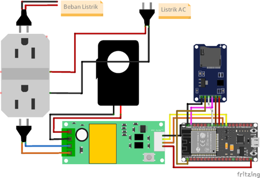
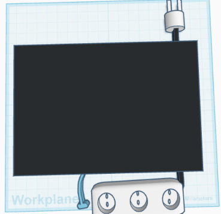
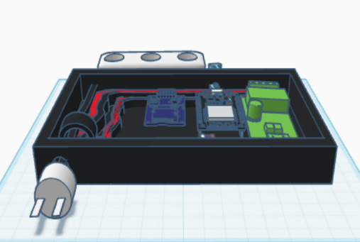
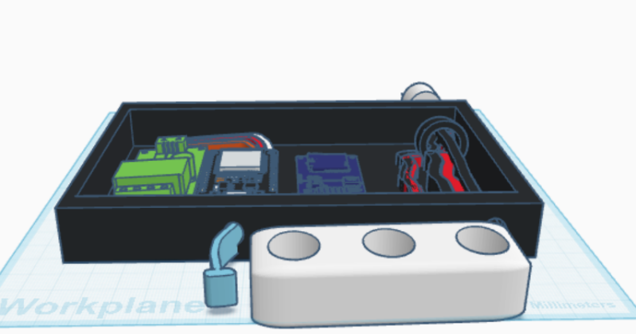

# ⚡ Sistem Monitoring dan Deteksi Anomali Listrik Berbasis IoT


Sistem pemantauan konsumsi listrik secara **real-time** berbasis IoT yang dilengkapi dengan kemampuan **deteksi anomali otomatis** dan notifikasi. Data tegangan, arus, daya, dan energi dikumpulkan oleh sensor PZEM-004T melalui mikrokontroler ESP32, lalu dikirim ke server web untuk ditampilkan pada dashboard dan dianalisis menggunakan algoritma deteksi anomali.

> 📖 Proyek ini merupakan penelitian skripsi di bidang Internet of Things (IoT) dan sistem monitoring energi.

---

## 📸 Dokumentasi Alat

### Skema Rangkaian


### Desain Fisik Alat
| Tampak Dalam | Tampak Luar | Tampak Samping |
|---|---|---|
|  |  |  |

---

## 🏗️ Arsitektur Sistem

```
[Beban Listrik] ──► [Sensor PZEM-004T] ──► [ESP32] ──► [WiFi]
                                                              │
                                                              ▼
                                                    [Server Web (PHP)]
                                                              │
                                              ┌───────────────┼───────────────┐
                                              ▼               ▼               ▼
                                        [Dashboard]   [MySQL Database]  [Notifikasi]
                                        (Real-time)    (Penyimpanan)   (Anomali Alert)
```

---

## ✨ Fitur Utama

- 📊 **Monitoring Real-time** — Pantau tegangan, arus, daya, dan energi secara langsung
- 🚨 **Deteksi Anomali** — Algoritma otomatis mendeteksi kondisi tidak normal pada konsumsi listrik
- 🔔 **Notifikasi** — Riwayat notifikasi anomali tersimpan dan dapat dipantau
- 📈 **Grafik & Visualisasi** — Tampilan grafik historis penggunaan energi
- 🌐 **Web Dashboard** — Antarmuka berbasis web yang responsif
- 📡 **Koneksi Status** — Indikator status online/offline perangkat IoT

---

## 🛠️ Komponen Hardware

| Komponen | Fungsi |
|---|---|
| **ESP32** | Mikrokontroler utama & koneksi WiFi |
| **PZEM-004T** | Sensor tegangan, arus, daya, dan energi AC |
| **SD Card Module** | Penyimpanan data lokal (cadangan) |
| **Catu Daya / PSU** | Sumber daya 5V untuk ESP32 |
| **Stop Kontak** | Output untuk beban listrik yang dipantau |
| **Enclosure** | Kotak pelindung seluruh komponen |

---

## 💻 Teknologi Software

| Layer | Teknologi |
|---|---|
| **Firmware** | Arduino (C++) untuk ESP32 |
| **Backend** | PHP |
| **Database** | MySQL |
| **Frontend** | HTML, CSS, JavaScript |
| **Protokol** | HTTP (ESP32 → Server) |
| **Library ESP32** | `PZEM004Tv30`, `WiFi`, `HTTPClient` |

---

## 🗄️ Struktur Database

Database: `monitor_listrik`

### Tabel `listrik`
Menyimpan seluruh data historis pengukuran sensor.

| Kolom | Tipe | Keterangan |
|---|---|---|
| `id` | INT (PK) | ID auto increment |
| `jam` | TIMESTAMP | Waktu pengukuran |
| `pemakaian` | FLOAT | Daya aktif (Watt) |
| `energi` | FLOAT | Energi kumulatif (kWh) |
| `tegangan` | FLOAT | Tegangan (Volt) |
| `arus` | FLOAT | Arus (Ampere) |

### Tabel `status_realtime`
Menyimpan status terkini perangkat dan hasil pembacaan sensor terakhir.

| Kolom | Tipe | Keterangan |
|---|---|---|
| `id` | INT (PK) | ID |
| `jam` | DATETIME | Waktu update terakhir |
| `tegangan` | FLOAT | Tegangan terakhir (V) |
| `arus` | FLOAT | Arus terakhir (A) |
| `pemakaian` | FLOAT | Daya terakhir (W) |
| `energi` | FLOAT | Energi terakhir (kWh) |
| `koneksi_status` | VARCHAR | `ONLINE` / `OFFLINE` |
| `anomali_status` | VARCHAR | `NORMAL` / anomali |
| `anomali_msg` | TEXT | Pesan status anomali |

### Tabel `riwayat_notifikasi`
Menyimpan log setiap kejadian anomali yang terdeteksi.

| Kolom | Tipe | Keterangan |
|---|---|---|
| `id` | INT (PK) | ID |
| `waktu_anomali` | DATETIME | Waktu anomali terjadi |
| `daya_val` | FLOAT | Nilai daya saat anomali (W) |
| `tgl_kirim` | TIMESTAMP | Waktu notifikasi dikirim |

---

## 📁 Struktur Direktori

```
energy-monitoring/
├── docs/
│   ├── skema_rangkaian.png
│   ├── alat_tampak_dalam.png
│   ├── alat_tampak_luar.png
│   └── alat_tampak_samping.png
├── database/
│   └── monitor_listrik.sql
├── api/
├── assets/
├── config/
├── includes/
├── index.php
├── analisis.php
├── history.php
└── README.md
```

---

## 🚀 Cara Instalasi

### 1. Prasyarat
- PHP >= 7.4 & Web Server (Apache/Laragon)
- MySQL >= 5.7
- Arduino IDE dengan board ESP32
- Library Arduino: `PZEM004Tv30`, `WiFi`, `HTTPClient`

### 2. Setup Database
```sql
CREATE DATABASE monitor_listrik;
mysql -u root -p monitor_listrik < database/monitor_listrik.sql
```

### 3. Setup Web Server
```bash
git clone https://github.com/cahyo0-dev/energy-monitoring.git
```
Taruh di folder `www` Laragon, lalu sesuaikan konfigurasi di `config/koneksi.php`.

### 4. Konfigurasi ESP32
```cpp
const char* ssid     = "NAMA_WIFI";
const char* password = "PASSWORD_WIFI";
const char* serverURL = "http://IP_SERVER/monitor_listrik/api/insert_data.php";
```

### 5. Akses Dashboard
```
http://localhost/monitor_listrik/
```

---

## 👨‍💻 Author

**cahyo0-dev**  
GitHub: [@cahyo0-dev](https://github.com/cahyo0-dev)

---

## 📄 Lisensi

Proyek ini dibuat untuk keperluan penelitian skripsi. Silakan digunakan sebagai referensi dengan mencantumkan sumber.

---

*⚡ Sistem Monitoring dan Deteksi Anomali Listrik — Skripsi IoT*
